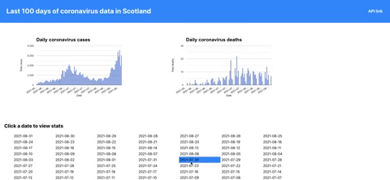

# JavaScript web app built with React.js

### To run
`npm install`
`npm start`
go to `localhost:3000`

API taken from `https://api.coronavirus.data.gov.uk/v1/data?filters=areaName=Scotland;areaType=nation&structure={%22date%22:%22date%22,%22name%22:%22areaName%22,%22code%22:%22areaCode%22,%22newCasesByPublishDate%22:%22newCasesByPublishDate%22,%22cumCasesByPublishDate%22:%22cumCasesByPublishDate%22,%22newDeaths28DaysByPublishDate%22:%22newDeaths28DaysByPublishDate%22,%22cumDeaths28DaysByPublishDate%22:%22cumDeaths28DaysByPublishDate%22}`

Docs at `https://coronavirus.data.gov.uk/details/developers-guide`

